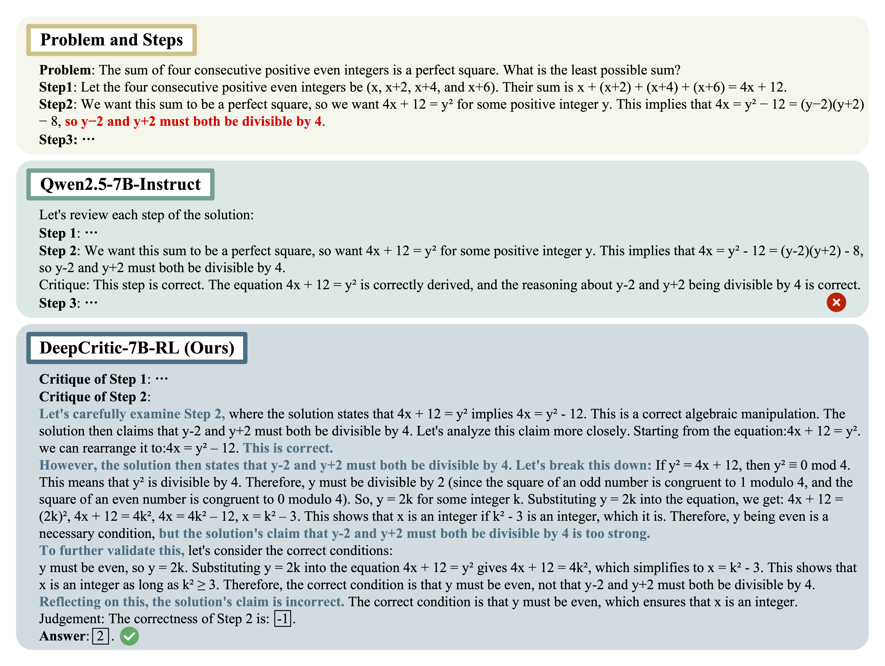

# DeepCritic: Deliberate Critique with Large Language Models
[](https://arxiv.org/abs/2505.00662)

 We propose **DeepCritic**, a novel framework to enable LLM critics to produce deliberate and in-depth critiques for mathematical solutions. 

<div style="display: flex; justify-content: center; flex-wrap: wrap;">
    
</div>

---------

## News
- [2025.05.18] We upload the code for RL data generation via Monte Carlo sampling-based correctness estimation.
- [2025.05.17] We upload the SFT and RL models, along with the curated SFT and RL data.
- [2025.05.11] We upload the code for deliberate critique generation, supervised fine-tuning and evaluation.
- [2025.05.01] We release our paper on [arxiv](https://arxiv.org/pdf/2505.00662).

## Models and Data
|           Name         |   |
|------------------------|:------|
|   DeepCritic-7B-SFT       | [hf model](https://huggingface.co/Keven16/DeepCritic-7B-SFT)   |
| DeepCritic-7B-RL-PRM800K | [hf model](https://huggingface.co/Keven16/DeepCritic-7B-RL-PRM800K) |
| DeepCritic-7B-RL-Numina | [hf model](https://huggingface.co/Keven16/DeepCritic-7B-RL-Numina) |
| SFT Data | [hf dataset](https://huggingface.co/datasets/Keven16/DeepCritic-4.5K) | 
| RL Data |  [hf dataset](https://huggingface.co/datasets/Keven16/DeepCritic-RL-Data)  |


## Installation
- For critique generation and supervised fine-tuning, you can follow the instructions in [alignment-handbook](https://github.com/huggingface/alignment-handbook) to create the environment. We also provide the pre-built [Docker image](https://hub.docker.com/layers/wenkyang/self-align/v24.05/images/sha256-21fb05198c783f3ece7485609b3064ffcce46bc23b152f3f6892dce41fee122f) for further usage. However, when use the Docker, please update the ``transformers`` version accordingly:
```bash
pip uninstall transformers -y
pip install transformers>=4.45.2
```

- For RL training, our code is mainly based on [verl](https://github.com/volcengine/verl), so you can directly follow the instrucions in [verl](https://github.com/volcengine/verl) to build the environment. Alternatively, you can use the pre-built [Docker image](https://hub.docker.com/layers/verlai/verl/vemlp-th2.4.0-cu124-vllm0.6.3-ray2.10-te1.7-v0.0.3/images/sha256-3c79824d78e1f039dd459f8020c82cf28d8b178134f6250b21c273cfd4dfea1d).


## Data
The evaluation data is in the ``data/`` directory. The raw data for SFT and RL data generation can be downloaded from [here](https://drive.google.com/file/d/1eeg-2X9-PSRTMJvBQv7sAmpzxZ8KXLxg/view?usp=sharing).

## Deliberate Critique Generation
The code for generating SFT data is in the ``Critique_Generation/`` directory. Please download the processed [PRM800K](https://github.com/openai/prm800k) data from [here](https://drive.google.com/file/d/1eeg-2X9-PSRTMJvBQv7sAmpzxZ8KXLxg/view?usp=sharing), and put it in the ``data/prm800k/``. We provide example commands in ``scripts/run_critique_gen.sh``, you can simply run the following command to generate the SFT data:
```bash
sh scripts/run_critique_gen.sh
```

## Supervised Fine-Tuning
Our SFT code is mainly based on [alignment-handbook](https://github.com/huggingface/alignment-handbook). After creating the deep critique data, please convert it to the required format for training:
```python
python3 sft/convert_data.py
```

Then, you can perform SFT by running
```bash
sh sft/run_sft.sh
```

## RL
### RL Data Generation
We provide the code for RL data generation via Monte Carlo sampling-based correctness estimation in the ``Critique_Generation/`` directory. The example commands are in ``scripts/run_rollout.sh``.
```bash
sh scripts/run_rollout.sh
```

### RL Training
Our RL training is mainly based on the open-source training platform [verl](https://github.com/volcengine/verl).

## Evaluation
Our evaluation code is mainly based on [ProcessBench](https://github.com/QwenLM/ProcessBench), and you can run the following script to perform evaluation on critique models:
```bash
sh scripts/run_eval.sh
```

## Acknowledgments
Our code is mainly based on [alignment-handbook](https://github.com/huggingface/alignment-handbook), [verl](https://github.com/volcengine/verl), and [ProcessBench](https://github.com/QwenLM/ProcessBench). We sincerely thank them for their open-sourcing!

## Citation
If you find our work helpful, please kindly cite as
```bibtex
@article{yang2025deepcritic,
  title={DeepCritic: Deliberate Critique with Large Language Models},
  author={Yang, Wenkai and Chen, Jingwen and Lin, Yankai and Wen, Ji-Rong},
  journal={arXiv preprint arXiv:2505.00662},
  year={2025}
}
```